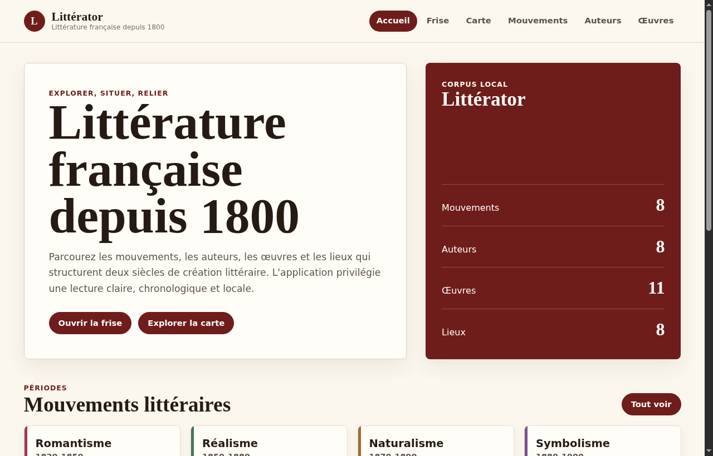
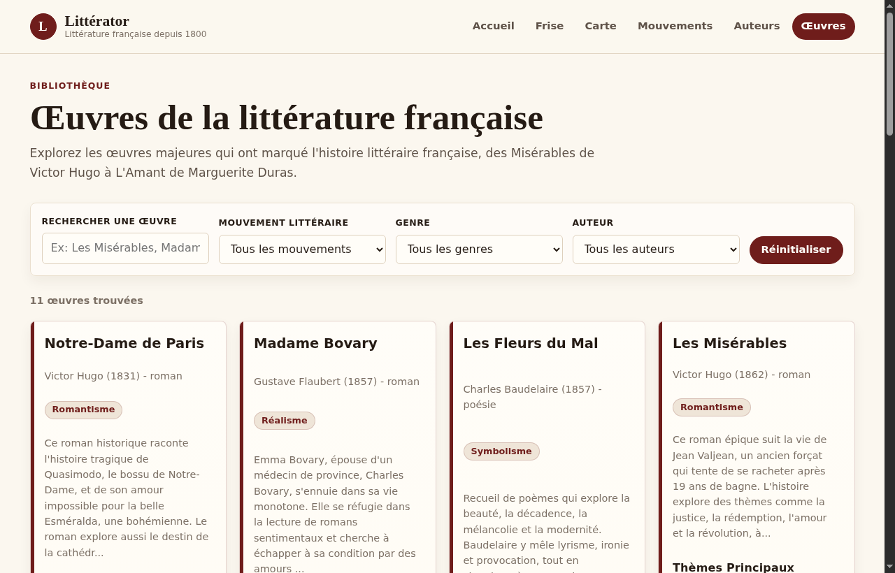
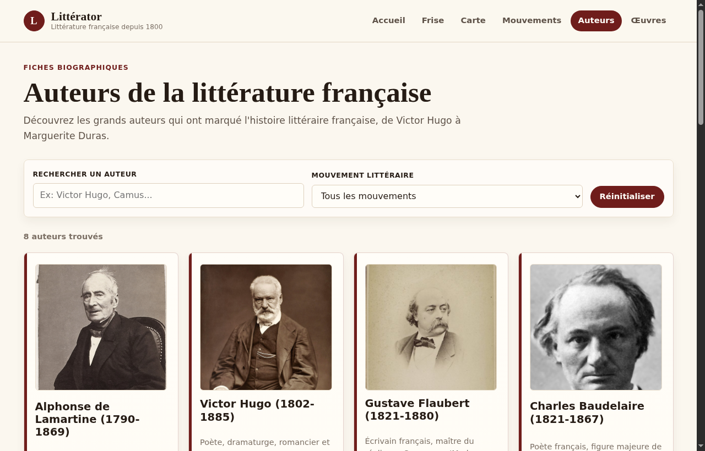
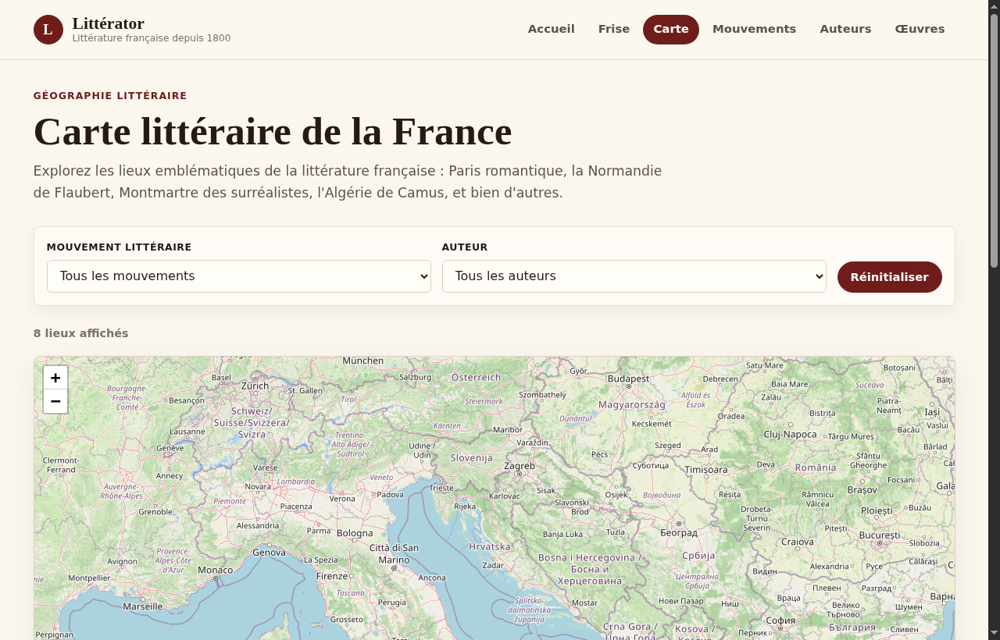

# Littérator

> PWA éditoriale pour explorer la littérature française depuis 1800.




## Pourquoi Littérator ?

Littérator rassemble mouvements, auteurs, œuvres, notions de glossaire et lieux littéraires dans une interface claire, installable et utilisable comme une application. Le projet met l'accent sur la consultation rapide, la navigation chronologique, les liens directs entre fiches et la découverte géographique.

## Aperçus

| Œuvres | Auteurs |
| --- | --- |
|  |  |

| Carte littéraire |
| --- |
|  |

## Fonctionnalités

| Icône | Module | Description |
| --- | --- | --- |
| Chronologie | Frise chronologique | Situer mouvements, œuvres, auteurs et événements historiques avec navigation horizontale, zoom et panneaux détaillés par année. |
| Carte | Carte littéraire | Explorer les lieux liés aux auteurs, œuvres et mouvements avec Leaflet et un fond CARTO. |
| Œuvres | Fiches œuvres | Parcourir les œuvres, leurs auteurs, genres, mouvements et visuels. |
| Auteurs | Fiches biographiques | Consulter biographies, œuvres principales, citations, portraits et lieux biographiques précis. |
| Mouvements | Fiches mouvements | Comprendre les courants littéraires, leurs influences, auteurs majeurs et œuvres clés en accordéons. |
| Glossaire | Notions littéraires | Rechercher les termes, procédés, genres, périodes et concepts, avec définitions complétées. |
| PWA | Application installable | Installer l'application sur desktop ou mobile, avec données locales précachées. |

## Corpus inclus

| Type | Volume |
| --- | ---: |
| Mouvements littéraires | 34 |
| Auteurs | 380 |
| Œuvres | 760 |
| Entrées de glossaire | 224 |
| Lieux littéraires éditoriaux | 8 |
| Lieux biographiques géocodés | 117 |

Le corpus inclut désormais les auteurs et œuvres de premier plan ainsi que des ensembles de second plan, troisième plan et angles morts reliés aux mêmes filtres, fiches, mouvements et vues chronologiques.
La page d'accueil reprend ces volumes dans le bloc `Corpus local`.

## Stack

| Couche | Technologie |
| --- | --- |
| Frontend | React 19 |
| Build | Vite |
| PWA | vite-plugin-pwa + Workbox |
| Carte | Leaflet + React Leaflet |
| Données | JSON local dans `public/data/` |
| UI | CSS custom, variables de thème, Grid/Flexbox |

## Démarrage

```bash
npm install
npm run dev
```

L'application est disponible sur :

```text
http://localhost:3000
```

Build production :

```bash
npm run build
npm run preview
```

## Installation PWA

1. Ouvrir Littérator dans Chrome, Edge ou un navigateur compatible PWA.
2. Cliquer sur l'action d'installation dans la barre d'adresse ou le menu du navigateur.
3. L'application s'installe avec son icône dédiée et se lance en mode autonome.

Les icônes PWA sont dans `public/icons/` et déclarées dans `public/manifest.json` ainsi que dans la configuration `vite-plugin-pwa`.

## Structure

```text
litterator-pwa/
├── public/
│   ├── data/             # Corpus JSON
│   ├── icons/            # Icônes PWA
│   ├── screenshots/      # Captures utilisées dans ce README
│   └── manifest.json
├── src/
│   ├── components/
│   ├── pages/
│   ├── styles/global.css
│   ├── App.jsx
│   └── main.jsx
├── index.html
├── package.json
└── vite.config.js
```

## Scripts

| Commande | Usage |
| --- | --- |
| `npm run dev` | Lance le serveur local. |
| `npm run build` | Génère la version production dans `dist/`. |
| `npm run preview` | Prévisualise le build production. |
| `npm run lint` | Lance Oxlint. |

## Personnaliser le corpus

Les données sont éditables directement en JSON :

```text
public/data/movements.json
public/data/authors.json
public/data/works.json
public/data/locations.json
public/data/place-coordinates.json
public/data/glossary.json
```

Après modification :

```bash
npm run build
```

## Design

La direction visuelle utilise une palette éditoriale unique :

- bordeaux pour l'identité et les actions principales ;
- ivoire pour les surfaces ;
- encre sombre pour le texte ;
- accent doré discret pour les détails.

Les variables sont centralisées dans `src/styles/global.css`.

## Navigation Profonde

Les fiches supportent les liens directs par hash :

```text
/authors#lamartine
/works#meditations-poetiques
/movements#romantisme
/timeline#movement-parnasse
/map#macon-france
```

Les utilitaires de normalisation et de scroll sont dans `src/utils/`.

## Sources

- Les portraits distants proviennent de Wikimedia Commons via Wikidata.
- Les images libres ajoutées pour le corpus de second plan proviennent de Wikimedia Commons ou de fichiers libres exposés par Wikipédia.
- Les lieux biographiques et coordonnées ajoutés proviennent de Wikidata, base structurée liée à Wikipédia.
- Les attributions connues sont documentées dans `public/images/ATTRIBUTIONS.md`.
